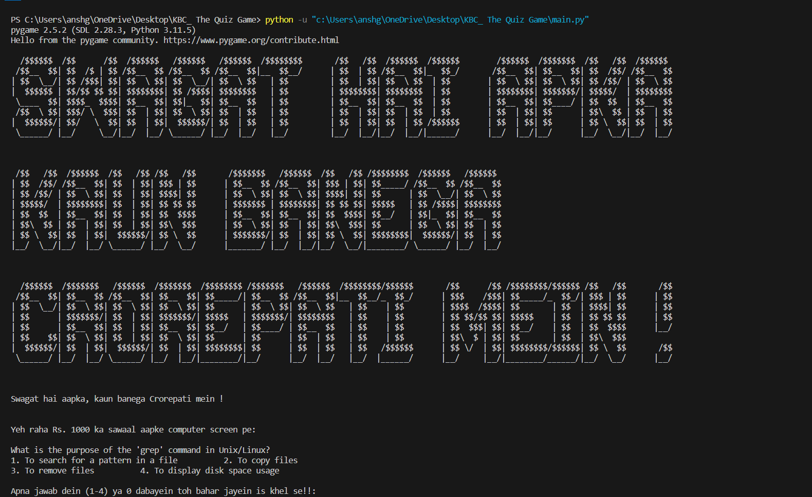

# KBC: The Quiz Game


[Watch the project demo on YouTube](https://www.youtube.com/watch?v=Ji4NlDG2mfY)



## Overview

Welcome to the exciting world of KBC: The Quiz Game project, where Amitabh Bachchan Sir's vibes meet the power of Python!

## Features

- **Interactive Quiz Game:** Dive into the world of quizzes with an engaging and interactive interface.
  
- **Amitabh Bachchan's Essence:** Experience the charm of Amitabh Bachchan Sir infused into every aspect of the project.
 
- **Python Magic:** Explore the coding magic with Python, including the use of lists, conditionals, and functions.
                    Randomly shuffles questions to ensure a unique experience each time.
                    Implements checkpoints at specific questions where the player can secure a certain amount of prize money.
 
- **Pygame Library Integration:** Take advantage of the Pygame library to enhance the gaming experience.


## Requirements

To run the game, make sure you have the following installed:

- Python 3.2
- Pygame library

```bash
pip install pygame
```

## How to Play

1. Clone the repository:

```bash
git clone https://github.com/techbire/kbc.git
```

2. Navigate to the project directory:

```bash
cd kbc
```

3. Run the game:

```bash
python main.py
```

4. Enjoy the KBC experience and test your knowledge across various topics!

## Contributing

Contributions are welcome! If you have ideas for improvements or new features, feel free to open an issue or submit a pull request.

## Acknowledgments

This project is inspired by the TV show "Kaun Banega Crorepati" and is created for educational purposes.

Feel the adrenaline, test your knowledge, and experience the thrill of KBC with our Python-powered quiz game!
